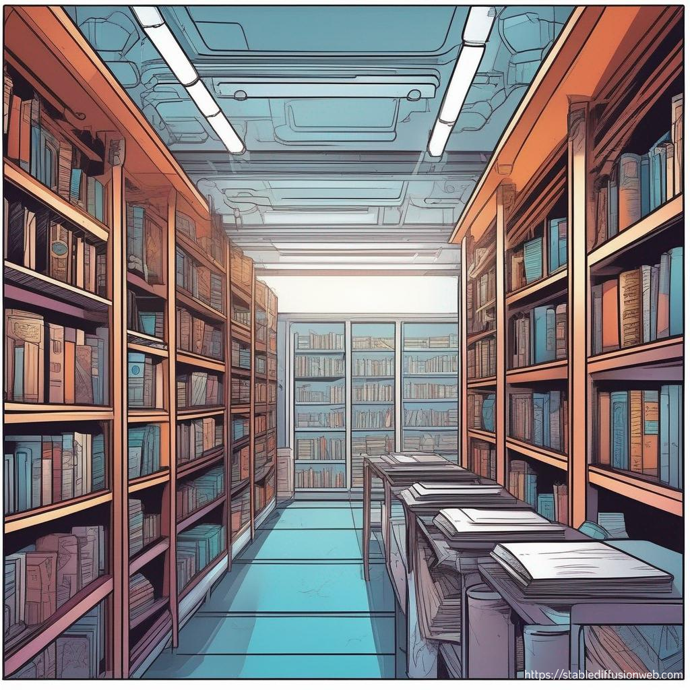

# Om docsVTFK

**En portal for teknisk dokumentasjon i Vestfold og Telemark fylkeskommune**

**Velkommen til docsVTFK** Her vil du finne teknisk dokumentasjon til diverse systemer. **Bruk menyen øverst for å komme til dokumentasjonen** Vi har også en liten blog som vi publiserer nyttige og unyttige tanker på forå  få et innblikk i noen av tingene vi tester ut på utviklingsavdelingen. Alt innhold er skrevet av og for mennesker 🤩

Hvem er vi? Vi er en sammensatt gjeng som jobber med å lage gode digitale tjenester for *hele* fylkeskommunen. Vi jobber med kode, design, arkitektur, brukeropplevelse, testing, drift, sikkerhet og mye mer. ...og vi liker å ha det gøy på jobb!

Vi er opptatt av å dele kunnskap og erfaringer med hverandre og med andre. Vi prøver å gjøre hverandre gode og vi er brenner for å levere gode tjenester.
